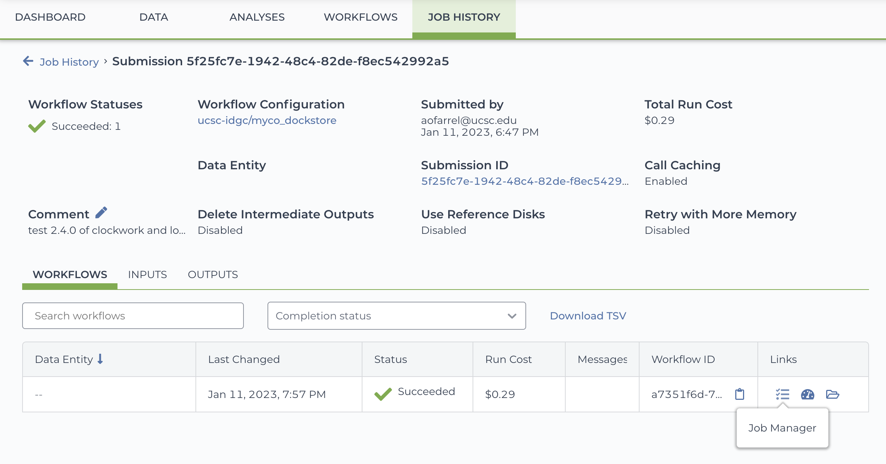
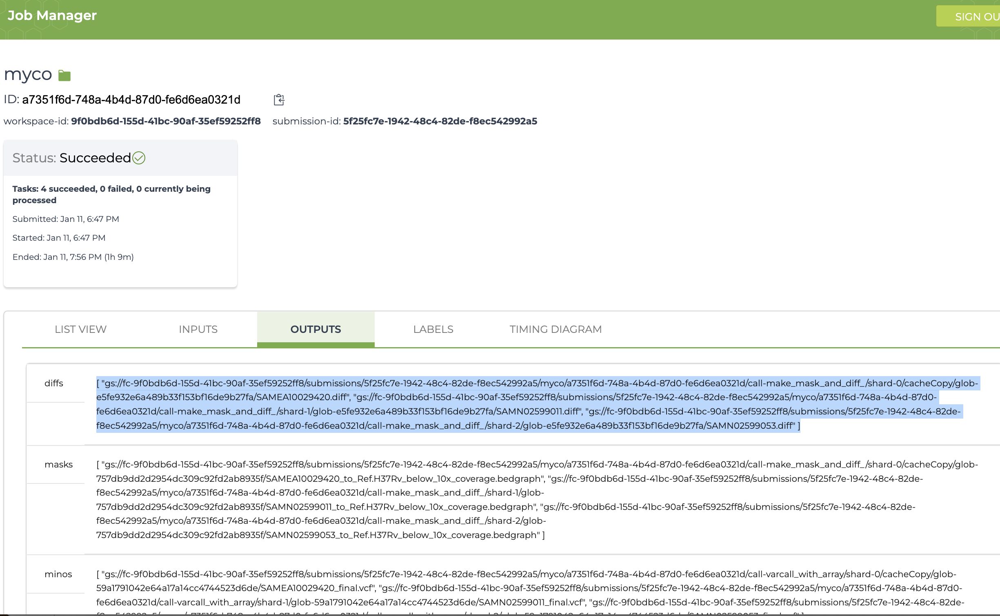

# pyoink
 Terra's UI makes it near-impossible to move your workflow outputs out of a workspace bucket en masse. It doesn't help that gsutil only wants to download 999 files in parallel, and that call cacheing and retries can put output files in unexpected folders. This Python script handles all that nonsense for you. Make sure you already have [gcloud CLI](https://cloud.google.com/sdk/gcloud) set up on whatever machine is facilitating the transfer, logged in as a user with write access to the Terra workspace.

 A wrapper specifically for [myco](github.com/aofarrel/myco) (aka "the first part of TB-D") is provided to make Option B easier.

 ## option A: copy-paste from Job Manager

 `python3 pyoink.py -jm [textfile_of_gs_addresses]`
 
 If you can get into Job Manager, you'll want this option. Just copy-paste as many output strings/arrays as you'd like into a text file, then feed that into pyoink. You can include any arbitrary files in the workspace bucket, even across different tasks or workflow runs.

## option B: search bucket recursively
If Job Manager refuses to load, you can enter the `--bucket`, `--submission_id`, `--task`, `--workflow_id`, and `--workflow_name` to sniff out the `--file` you're looking for, across any and all shards. If output basenames vary by shard, you can use wildcards, such as `results/*.json` or `*.vcf`. However, if outputs make use of WDL's `glob()` feature, make sure to also set `--glob`. By default it will be assumed your task is scattered, if not, use the `--notscattered` flag.

Because option B uses a lot of `gsutil ls` commands, it is slower than option A and may incur some additional costs.
